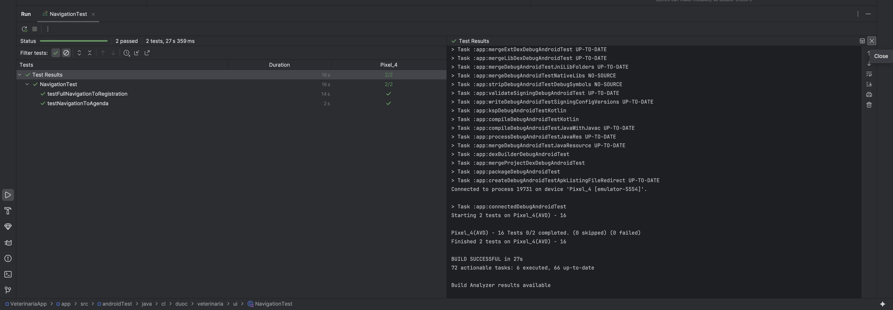
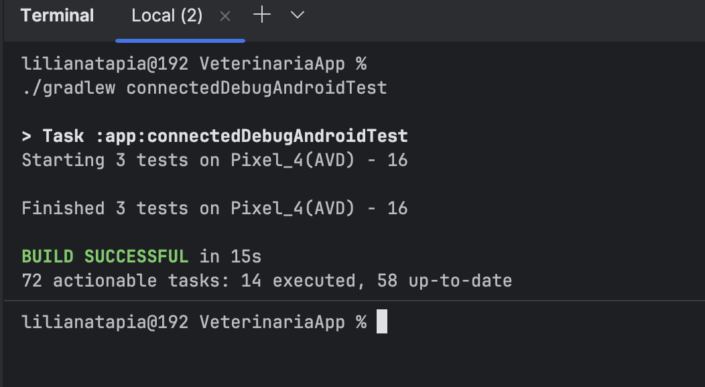

# VeterinariaApp - Actividad Sumativa 3 (Semana 8)
## Validando y publicando tu aplicación Android

### 📝 Descripción de la Actividad
Este proyecto consolida la **VeterinariaApp** mediante una refactorización integral hacia una arquitectura **MVVM (Model-View-ViewModel)**. Se han aplicado principios de **modularidad y desacoplamiento**, integrando componentes de **Jetpack** y una suite de pruebas robusta que garantiza la estabilidad del sistema antes de su distribución final.

### ✨ Funcionalidades Principales
*   **Autenticación**: Login y Registro con persistencia de sesión segura.
*   **Gestión de Atenciones**: Flujo guiado para el registro de mascotas y servicios.
*   **Agenda Personalizada**: Consulta de citas y historial médico del usuario.
*   **Farmacia Digital**: Catálogo con carrito de compras y validación de stock.
*   **Accesibilidad (UX)**: Soporte para Modo Oscuro y control de escala de fuente adaptativo (Optimizado para dispositivos de alta densidad como Samsung S24).

---

### 🏗️ Arquitectura y Tecnologías
El proyecto destaca por una separación de capas clara y mantenible:

1.  **Capa de Vista (UI):** Desarrollada con **Jetpack Compose**, utilizando componentes declarativos para una interfaz moderna.
2.  **Capa de Lógica (ViewModel):** Uso de `ViewModel` y **StateFlow** (equivalente moderno y reactivo a LiveData) para gestionar el estado de la UI de forma desacoplada.
3.  **Capa de Datos:** 
    *   **Room Database:** Persistencia local estructurada y eficiente.
    *   **Retrofit:** Consumo de servicios API REST.
    *   **Repository Pattern:** Capa de abstracción que garantiza el desacoplamiento entre el origen de datos y la lógica de negocio.
4.  **Navegación:** **Navigation Compose** para la gestión de rutas y paso de argumentos.

---

### 🧪 Estrategia de Testing
Se han implementado pruebas automatizadas para validar la integridad del sistema:

#### 1. Pruebas Unitarias (JUnit 4 + MockK + Turbine)
*   **Alcance:** Validación de lógica de negocio en `ValidationUtils` y gestión de estados de registro en `RegistroViewModel` (carrito, validación de stock y limpieza de datos).
*   **Comando:** `./gradlew test`

#### 2. Pruebas de UI e Instrumentadas (Compose Test / Espresso)
*   **Alcance:** Validación de flujos críticos de usuario: Inicio de sesión, navegación a la Agenda y proceso completo de registro de mascotas.
*   **Comando:** `./gradlew connectedDebugAndroidTest`
*   **Requisitos:** Dispositivo físico o emulador (API 24+) con depuración activa.

---

### 🚀 Instrucciones para la Revisión

#### Instalación y Ejecución
1.  Importar el proyecto en Android Studio.
2.  Sincronizar Gradle y ejecutar mediante el botón **Run 'app'**.
3.  Alternativamente, instalar el **APK firmado** disponible en los archivos de entrega.

#### Replicación de Pruebas
*   **Unitarias:** Click derecho en la carpeta `app/src/test` -> *Run*.
*   **Instrumentadas:** Asegurar un emulador/dispositivo conectado y ejecutar desde `app/src/androidTest`.

---

### 📸 Evidencias de Validación
*   **Pruebas Unitarias (Local):** 
*   **Pruebas de UI (Instrumentadas):** 

---

### 🏁 Cierre Técnico
*   **Configuración APK:** Iconos adaptativos, permisos de sistema (Internet, Notificaciones, Foreground Service) y nombre de aplicación configurados.
*   **Versión:** 1.1 (Build 2).
*   **Estado:** Proyecto refactorizado, validado bajo estándares de calidad y **APK firmado** listo para distribución.

---
**Desarrollado por:** Liliana Tapia  
**Asignatura:** Desarrollo de Aplicaciones Móviles II  
**Institución:** DUOC UC
